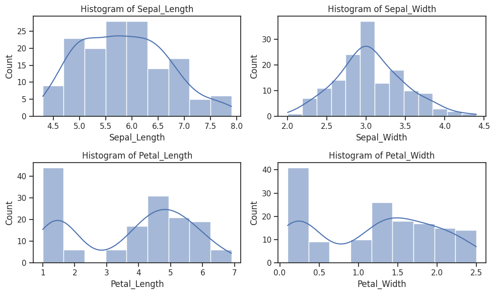
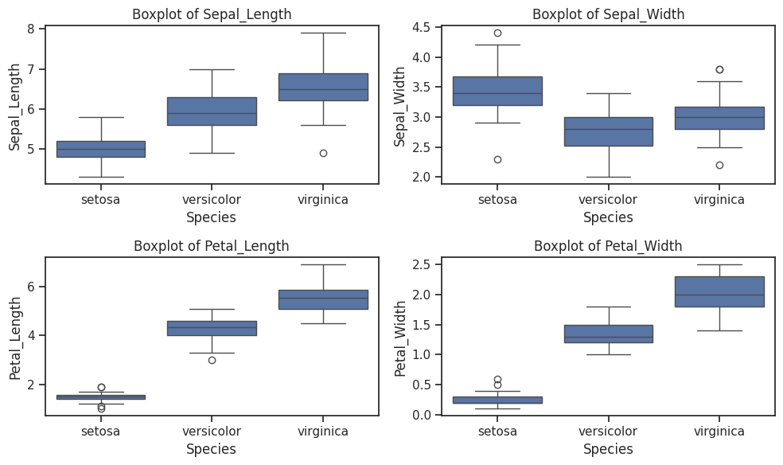
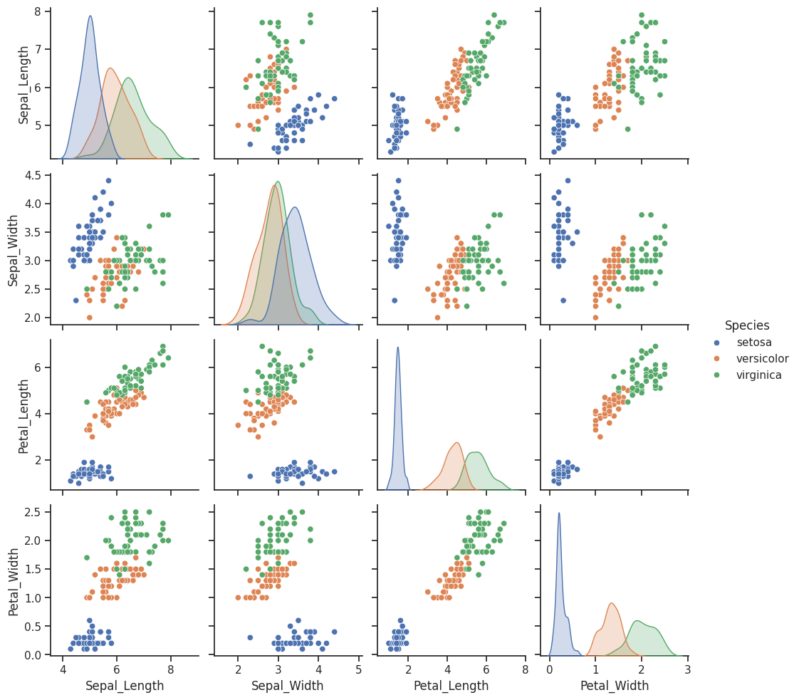

# my-logistic-regression-project_1
This project demonstrates the implementation of a logistic regression model using Python and scikit-learn.

# Logistic Regression Project

## Overview
This project demonstrates the implementation of logistic regression models using Python and scikit-learn. The goal is to classify data from two different datasets: the Iris dataset and the Digits dataset.

## Dataset 1: Iris

**Using the Iris dataset (iris.csv attached or using sklearn):**

### Questions:

1. **Perform an initial analysis of this dataset:**
   - Analyze the dataset structure and summary statistics.
   - Determine the number of samples and features.
   - Check for missing values and data types.
   - How many data samples are there?
   - Are there any missing values? If so, how many?
   - Are all the data numeric, or are there columns with categorical data?
   - Apply logistic regression to evaluate the classification model.

2. **Use boxplots and histograms to characterize the properties of each species:**
   - Plot boxplots for Sepal Length, Sepal Width, Petal Length, and Petal Width.
   - Plot histograms for the same features.
     ### Histogram of Petal Length

### Histogram of Petal Length
This histogram visualizes the distribution of petal lengths across all samples in the Iris dataset. It shows that the majority of samples have petal lengths between 1.0 and 1.5 units, with some outliers towards higher values.


### Boxplot of Petal Width
This boxplot illustrates the distribution of petal widths for each species in the Iris dataset. It shows the median, quartiles, and any outliers for each species.



### Pair Plot
The pair plot provides a comprehensive view of the relationships between different features in the Iris dataset. Each scatter plot represents the relationship between two features, colored by species.


3. **By only looking at these graphs, is it possible to use one or more of the properties (Sepal Length, Sepal Width, Petal Length, Petal Width) to differentiate between the different species?**

   Given that the Iris dataset is small and has only four features, we can manually assess their importance based on the EDA we conducted earlier. From the pair plot, we can observe how well the different species are separated by each feature. Features that show distinct clusters for different species are likely to be more important for classification.

   Based on the pair plot, the Petal Length and Petal Width seem to provide the best separation between the different species, followed by Sepal Length. Sepal Width appears to have less discriminatory power compared to the other features.

   Therefore, for feature selection in this case, we might choose to use only Petal Length and Petal Width as the input features for our logistic regression model.

5. **Apply logistic regression to evaluate the classification model.**

6. **Calculate accuracy, precision, and recall of the model.**

7. **Plot the confusion matrix using matplotlib or seaborn.**

## Dataset 2: Digits

**Using the Digits dataset. Example of how to import the dataset using sklearn:**

The digits dataset is a popular dataset used in machine learning and computer vision tasks. It is included as part of the sklearn.datasets module in scikit-learn, a popular machine learning library in Python. 
This dataset contains images of handwritten digits (0 through 9) represented as 8x8 pixel images. Each image is represented as an array of 64 pixels, and the dataset also includes the corresponding labels indicating the true digit for each image.

```python
from sklearn.datasets import load_digits
digits = load_digits()
```

## Dataset
- Description of the dataset
- Source of the dataset

## Steps
1. Data Preprocessing
2. Model Training
3. Model Evaluation
4. Results

## Installation
1. Clone the repository
   ```bash
   git clone https://github.com/your_username/your_repository.git
